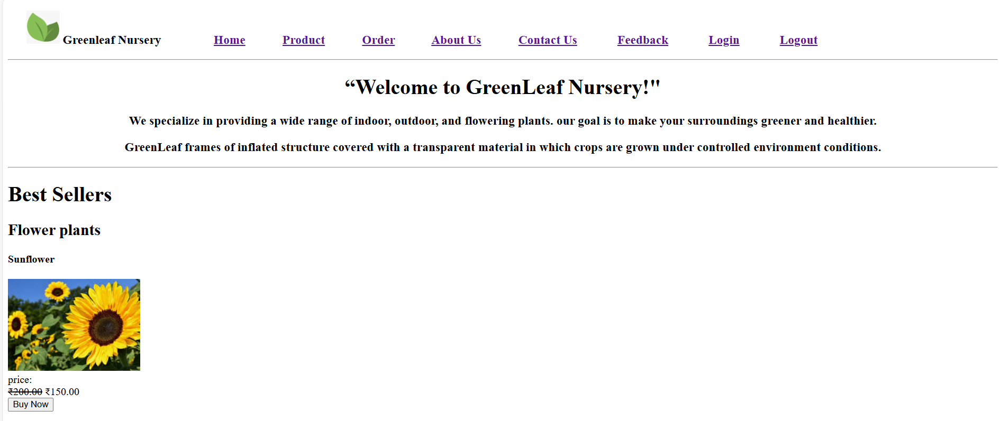
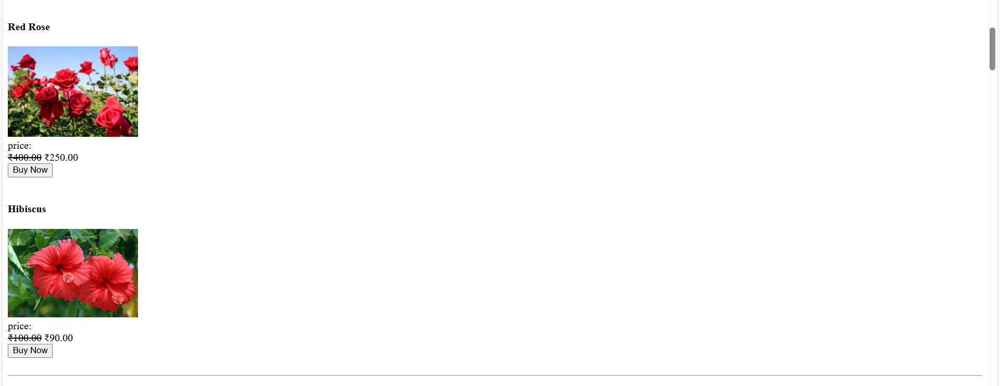
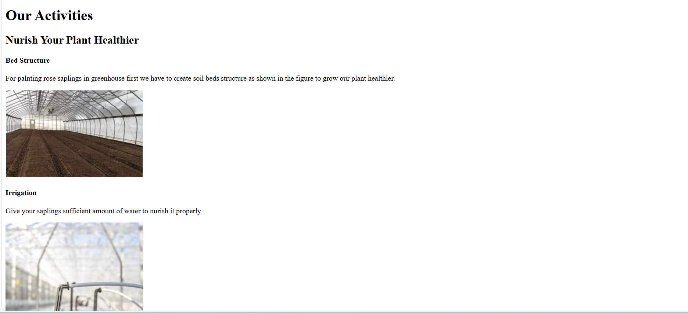
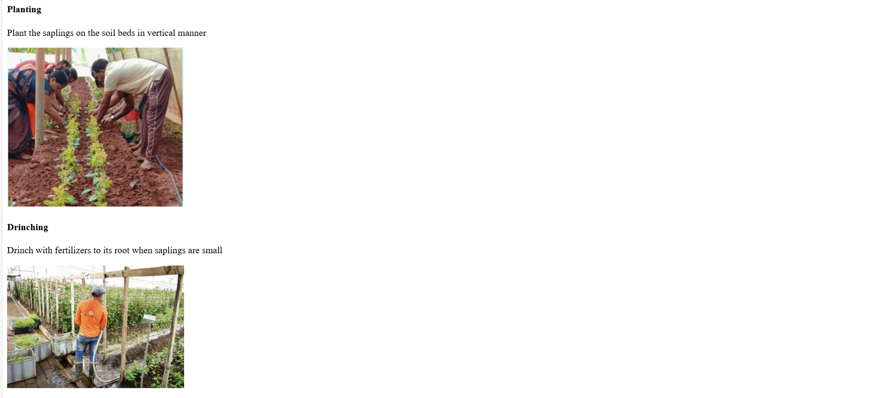
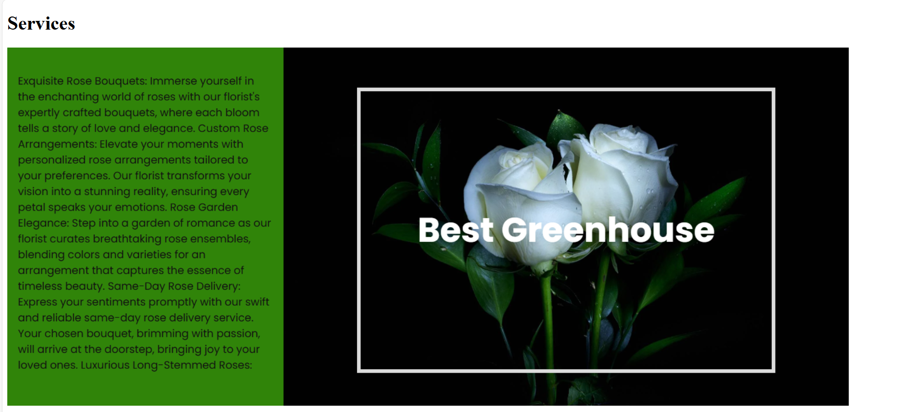
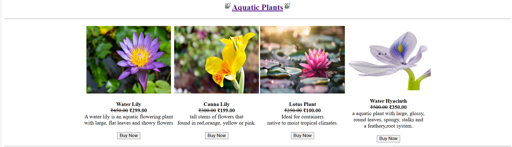
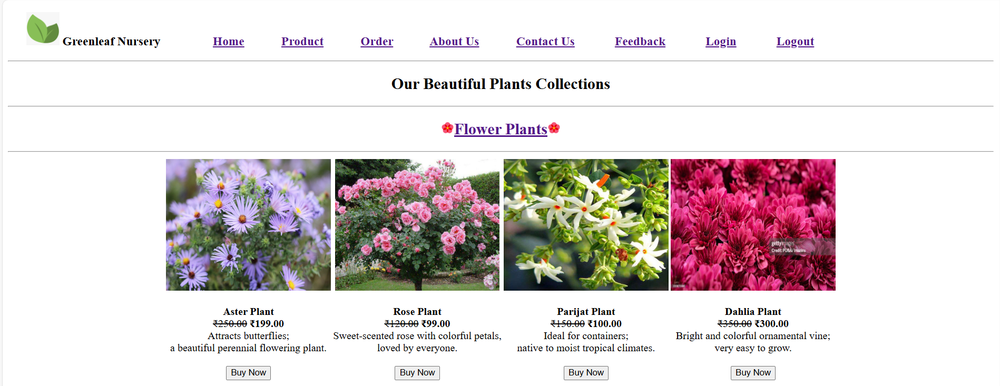

# Greenleaf Nursery
## Welcome to Greenleaf Nursery, an online nursery management system designed to promote green living by offering a wide range of plants, tools, and garden essentials. 
## This website allows users to browse different plant categories, learn about nursery activities, place orders, and connect with us directly.
---
### Visit Greenleaf Website:[https://greenleaf-nursery.netlify.app/](https://greenleaf-nursery.netlify.app/)
---
### The *Greenleaf Nursery Management System* is a simple, static website built using **HTML**.  
### It show various categories of plants and provides a user-friendly interface for visitors to explore and order nursery products.
---
### Features:
- **Home Page:** Introduction to the nursery, mission, and goals.  
- **Product Page:** Displays categories like Flower Plants, Fruit Plants, Pot Plants, Aquatic Plants, Tools, and Pesticides.  
- **Category Section:** Plants are neatly divided into categories with names, images, and prices.  
- **Booking / Order Form:** Allows customers to place orders easily.  
- **About Us:** Provides information about the nursery’s background and activities.  
- **Gallery:** A visual section showing nursery images and plant samples.  
- **Contact Page:** Displays contact details (address, phone, and email).  
- **Feedback Form:** Lets users share their feedback and suggestions.  
- **Login Page:** User login section for accessing personalized services (future upgrade ready).  
- **Category pages of plants:**
  - Flowers.html
  - Fruits.html
  - pot.html
  - Aquatic.html
---
### Screenshots of home page:
#### Welcome Message
#### Best Sellers

#### Activities

#### Services

#### Our Products
#### Aquatic Plants

#### Flower Plants

---
### Contact Information:
**Greenleaf Nursery**  
Maharashtra, India  
+91 0123456789  
greenleafnursery@gmail.com  
[https://greenleaf-nursery.netlify.app/](https://greenleaf-nursery.netlify.app/)
---
### Project Structure:
Greenleaf-Nursery:
1. index.html # Home page
2. about.html # About page
3. contact.html # Contact page
4. feedback.html # Feedback page
5. login.html # Login page
6. products.html # Product categories
7. order.html # Order form
8. Category pages of plants:
  - Flowers.html
  - Fruits.html
  - pot.html
  - Aquatic.html
8. images # Image assets (plants, icons)
9. README.md # Project documentation
---
### Future Enhancements:
- Add a dynamic **shopping cart system**.
- Integrate **payment gateway**.
- Add a **user registration** and **admin dashboard** for managing inventory.
- Include **blog section** for plant care tips.
- Implement **search and filter options** for easier navigation.
---
### Contributors:
- Purva Khairnar
- Tejal Shinde
- Pratiksha Ugale
- Sneha More
- Darshana Deore
- Vaishnavi Pawar
---